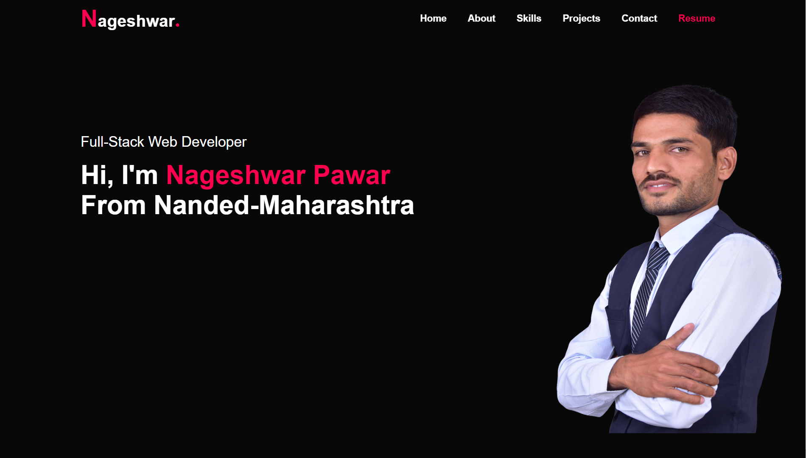

# My Portfolio

Welcome to my personal portfolio repository! This project showcases my journey as a web developer, featuring projects, skills, and experiences that I've accumulated over the years.

## 🚀 About Me

I'm a passionate web developer with a keen interest in creating dynamic and user-friendly web applications. My journey has been driven by curiosity and a constant desire to learn and grow in the field of web development.

## 🛠️ Technologies & Tools

- **Languages:** JavaScript, HTML, CSS, Node.js
- **Frameworks/Libraries:** React, Express, MongoDB
- **Tools:** Git, Docker, Visual Studio Code, Cloudinary
- **Other Skills:** RESTful API, Responsive Design

## 📁 Project Highlights

### [E-commerce Website](https://nordstromrack-com-frontend.vercel.app/)

An E-commerce platform built using the MERN stack. It includes features like user authentication, product management, and an admin panel.

- **Frontend:** React, Redux, TailwindCSS
- **Backend:** Node.js, Express
- **Database:** MongoDB
- **Features:** Login, SignUp, Product Management, Admin Panel, User-friendly UI

### [Movie & TV Series Website](https://movix-by-nageshwar.netlify.app//)

Dive into a world of entertainment where you can explore, discover, and stay updated with your favorite movies and TV shows. This platform offers a seamless browsing experience with detailed information, ratings, and reviews to help you decide what to watch next.

- **Frontend:** HTML, CSS, JavaScript
- **Database:** TMDB API
- **Features:** Browse, Details, , Sorting, Filtering , User-friendly UI

### [Certificate of Appreciation](./Images/readmeImages/certificate.jpg)

I am proud to have received a certificate from Masai School for achieving 100% assignment submission in their intensive 60-day crash course. This accomplishment reflects my dedication, discipline, and commitment to consistently completing and submitting all assignments on time, showcasing my ability to manage rigorous coursework and adhere to deadlines effectively.

Participation in community sessions at Masai School, focusing on topics like assignment solving, problem-solving skills, and sharing my journey.

## 📈 My Journey

I've been actively participating in various community sessions and projects, continuously honing my skills and knowledge. My goal is to become a successful and highly skilled web developer, capable of creating impactful and innovative web solutions.

## 📫 Get in Touch

- **Portfolio:** [myportfolio.com](https://nageshwar-pawar-personal-portfolio.netlify.app/)
- **GitHub:** [Nageshwar1997](https://github.com/Nageshwar1997)
- **LinkedIn:** [Nageshwar Pawar](https://www.linkedin.com/in/nageshwar-pawar-a25041289/)
- **Email:** nageshpawarpatil@gmail.com

## 🌟 Acknowledgements

Special thanks to Masai School for providing a supportive learning environment and to the open-source community for all the amazing tools and resources.

Feel free to explore my projects, and don't hesitate to reach out if you have any questions or collaboration ideas!
